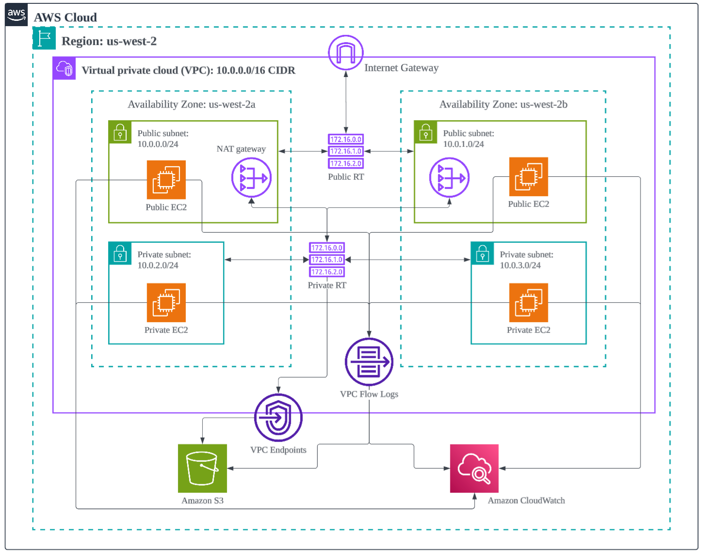

# Task 1 — Create VPC Infrastructure

## Task Description

This project demonstrates the creation of a **custom AWS VPC** to host secure and scalable cloud resources across public and private subnets.  
It includes routing, NAT gateway setup, Internet connectivity, security groups, IAM roles, and flow logging using CloudWatch and S3.

---

## 🧭 VPC Architecture Overview

The infrastructure consists of:
- **Custom VPC**
- **Public & Private Subnets** across multiple Availability Zones
- **Internet Gateway** for outbound access
- **NAT Gateway** for private subnet internet connectivity
- **Route Tables** for public and private routing
- **Security Groups** and **Network ACLs** for traffic control
- **VPC Flow Logs** integrated with **CloudWatch** and **S3**
- **VPC Endpoints** for private AWS service access

  

---

## Tasks Breakdown

### **Task 1.1 – Create a Custom VPC**
- **VPC Name:** `umar-vpc`  
- **CIDR Block:** `10.0.0.0/16`

---

### **Task 1.2 – Define Public and Private Subnets**
| Subnet Type | Name | AZ | CIDR |
|--------------|------|----|------|
| Public | public-subnet-a | us-west-2a | 10.0.0.0/24 |
| Public | public-subnet-b | us-west-2b | 10.0.1.0/24 |
| Private | private-subnet-a | us-west-2a | 10.0.2.0/24 |
| Private | private-subnet-b | us-west-2b | 10.0.3.0/24 |

---

### **Task 1.3 – Internet Gateway**
- **Name:** `umar-igw`  
- **Attached to:** `umar-vpc`

---

### **Task 1.4 – Route Tables**
| Route Table | Associated Subnets | Target |
|--------------|--------------------|---------|
| `umar-public-route-table` | public-subnet-a, public-subnet-b | Internet Gateway (`umar-igw`) |
| `umar-private-route-table` | private-subnet-a, private-subnet-b | NAT Gateway (`umar-nat-gateway`) |

---

### **Task 1.5 – NAT Gateway**
- **Name:** `umar-nat-gateway`  
- **Subnet:** `public-subnet-a`  
- **Elastic IP:** `eipalloc-0d07b3272e0c6b5a2`  
- **Destination:** `0.0.0.0/0` → `umar-nat-gateway`

---

### **Task 1.6 – Security Groups**

#### Public Security Group — `umar-public-sg`
**Inbound Rules**
- ICMP (Ping) — `0.0.0.0/0`
- HTTP — `0.0.0.0/0`
- SSH — `0.0.0.0/0`

**Outbound Rules**
- All traffic — `0.0.0.0/0`

#### Private Security Group — `umar-private-sg`
**Inbound Rules**
- ICMP, HTTP, SSH — from `umar-public-sg`

**Outbound Rules**
- All traffic — `0.0.0.0/0`

---

### **Task 1.7 – EC2 Instances**
| Instance | Subnet | AMI | Type | Key Pair | Security Group |
|-----------|---------|-----|------|-----------|----------------|
| `ec2-public-a` | public-subnet-a | Ubuntu 24.04 LTS | t3.micro | umarsatti.pem | umar-public-sg |
| `ec2-private-a` | private-subnet-a | Ubuntu 24.04 LTS | t3.micro | umarsatti.pem | umar-private-sg |

---

### **Task 1.8 – IAM Role and Policy for VPC Flow Logs**
**IAM Role:** `umar-vpc-flowlogs-role`  
**Trusted Entity:** `vpc-flow-logs.amazonaws.com`

**Policy Permissions:**
- logs:CreateLogGroup  
- logs:CreateLogStream  
- logs:PutLogEvents  
- logs:DescribeLogGroups  
- logs:DescribeLogStreams

---

### **Task 1.9 – CloudWatch Log Group**
- **Name:** `umar-vpc-logs`  
- **Retention:** Never Expire  
- **Purpose:** Store VPC Flow Logs for monitoring network activity.

---

### **Task 1.10 – Enable VPC Flow Logs**
- **Name:** `umar-vpc-flowlogs`  
- **Destination:** CloudWatch Logs  
- **Log Group:** `umar-vpc-logs`  
- **IAM Role:** `umar-vpc-flowlogs-role`

---

### **Task 1.11 – S3 Bucket for Flow Logs**
- **Bucket Name:** `umar-vpc-flowlogs-s3-bucket`  
- **Public Access:** Blocked  
- **Encryption:** SSE-S3 Enabled  
- **Versioning:** Disabled  

---

### **Task 1.12 – VPC Endpoint for S3**
- **Endpoint Name:** `umar-vpc-endpoint-s3`  
- **Service:** `com.amazonaws.us-west-2.s3`  
- **Type:** Gateway  
- **Flow Log Destination:** S3 bucket above

---

### **Task 1.13 – Connectivity Tests**
- Verified connectivity between:
  - Public ↔ Private EC2 instances
  - Both instances → Internet (`ping google.com`)
- Used **MobaXterm SSH Client** for secure connection (`chmod 400 umarsatti.pem`)
- CloudWatch logs confirm successful ICMP communication.

---